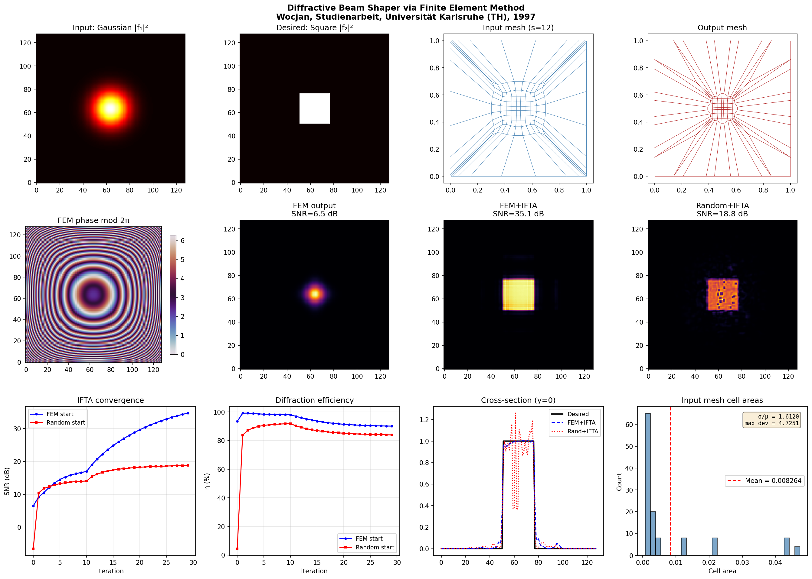
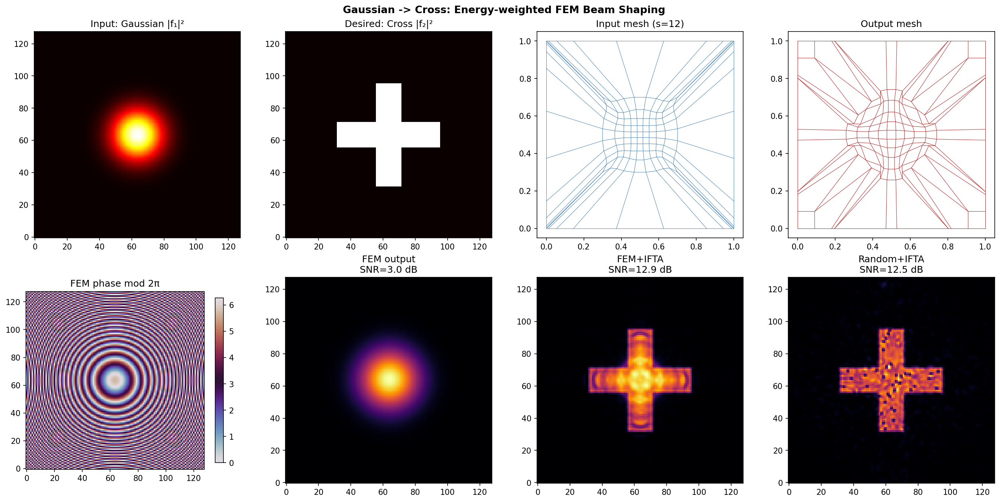

# Diffractive Beam Shaper Design via Finite Element Method

<p align="center">
  
</p>

<p align="center">
  <em>Title image from the 1997 Studienarbeit: Marilyn Monroe's face and the corresponding
  energy-equalized mesh. The mesh cells become larger over the dark mouth region
  (less energy) and smaller over the bright forehead and cheeks (more energy).</em>
</p>

## About This Project

This is a **Python re-implementation** of the methods described in:

> **Pawel Wocjan**, *"Entwurf diffraktiver Strahlformer mit der Methode der finiten Elemente"*
> (Design of Diffractive Beam Shapers Using the Finite Element Method),
> Studienarbeit, Institut für Algorithmen und Kognitive Systeme (IAKS),
> Fakultät für Informatik, Universität Karlsruhe (TH), Sommersemester 1997.
> Supervised by Prof. Dr. Th. Beth and Dipl.-Inform. M. Schmid.

The original implementation was written in **C++ in 1997** and was integrated into
**DigiOpt**, a diffractive optics design system developed at the IAKS under
Prof. Thomas Beth. Neither the original code nor DigiOpt exist anymore.
This Python version recreates the complete pipeline from scratch, almost 30 years later.

The goal is to design a thin optical element — a **diffractive phase element (DPE)** —
that reshapes a laser beam into a desired intensity pattern using **finite element meshes**
to compute the energy-redistributing geometric transformation, then recovering the phase
function via the **stationary phase approximation**.

For the full mathematical description, see [docs/method.pdf](docs/method.pdf).

## Installation

**Prerequisites:** Python 3.8 or later.

```bash
# Create and activate a virtual environment
python -m venv .venv

# Windows:
.venv\Scripts\activate

# macOS/Linux:
source .venv/bin/activate

# Install dependencies
pip install -r requirements.txt
```

### VS Code Integration

1. Open the project folder in VS Code (File → Open Folder).
2. Press `Ctrl+Shift+P` → "Python: Select Interpreter" → choose the `.venv` interpreter.
   If it doesn't appear, click "Enter interpreter path..." and browse to `.venv\Scripts\python.exe`.
3. The integrated terminal will automatically activate the virtual environment.

## Quick Start

```bash
# Main example: Gaussian beam → Square flat-top
python examples/circle_to_square.py

# Second example: Gaussian beam → Cross-shaped pattern
python examples/gaussian_to_cross.py
```

Each example prints a results table and saves a `.png` figure showing the meshes,
phase function, output intensities, and IFTA convergence curves.





## Project Structure

```
diffractive_fem/
├── README.md
├── requirements.txt
├── LICENSE_CODE                    ← GNU GPL v3 (Python code)
├── LICENSE_STUDIENARBEIT           ← CC BY 4.0 (Studienarbeit)
│
├── diffractive_fem/                ← Python package
│   ├── __init__.py
│   ├── mesh.py                     ← Mesh generation & optimization (§4.1–4.3)
│   ├── phase.py                    ← Polynomial phase recovery (§4.4)
│   ├── propagation.py              ← Fourier wave propagation (§1)
│   ├── metrics.py                  ← SNR and diffraction efficiency (§5)
│   ├── ifta.py                     ← Iterative Fourier Transform Algorithm
│   └── visualization.py            ← Plotting utilities
│
├── examples/
│   ├── circle_to_square.py         ← Gaussian → Square beam shaping
│   └── gaussian_to_cross.py        ← Gaussian → Cross pattern
│
├── docs/
│   ├── method.tex                  ← Mathematical description (LaTeX source)
│   └── method.pdf                  ← Mathematical description (compiled)
│
└── studienarbeit/                  ← Original 1997 LaTeX source (modernized)
    ├── ausarb.tex                  ← Main document (German)
    ├── vortrag.tex                 ← Presentation slides
    ├── titel.tex                   ← Title page
    └── *.pdf                       ← Figures
```

## Method Overview

The pipeline has four steps:

1. **Mesh generation**: Create topologically equivalent meshes over input and output planes.
   Initialize interior nodes via 4-point (rectangular) or 6-point (triangular) interpolation.

2. **Mesh optimization**: Iteratively move nodes so corresponding cells contain equal energy.
   For constant-intensity signals, this reduces to equal-area optimization (8-point algorithm).
   For general signals, energy-weighted Laplace smoothing is used with a mesh validity check
   to prevent cell tangling.

3. **Phase recovery**: The mesh correspondences define a geometric transformation.
   The stationary phase condition gives a linear system for the coefficients of a
   bivariate polynomial approximation of the phase function, solved via least squares.

4. **IFTA refinement**: The FEM phase serves as starting point for the Iterative Fourier
   Transform Algorithm (Gerchberg–Saxton), which further optimizes SNR and diffraction
   efficiency.

For equations and derivations, see [docs/method.pdf](docs/method.pdf).

## Original Results (1997)

Results from the Studienarbeit comparing IFTA starting points
(10 efficiency + 20 SNR iterations):

| Input → Output    | Method    | SNR (dB) | η (%) |
|--------------------|-----------|----------|-------|
| Circle → Marilyn   | SepOp     |    19.3  | 78.6  |
|                    | Random    |    13.8  | 68.9  |
|                    | **FEM**   | **20.8** |**79.0**|
| Insep. → Marilyn   | SepOp     |    32.8  | 92.1  |
|                    | **FEM**   | **35.8** | 86.0  |
| Gauss → Marilyn    | **SepOp** | **31.4** |**92.5**|
|                    | FEM       |    29.9  | 83.0  |

The FEM method excels for non-separable input signals.

## Known Limitations and Future Work

- **Mesh energy equalization** uses a weighted-Laplace heuristic. The original C++ code used
  exact symbolic formulas (computed with Mathematica, simplified with Magma) that likely
  converge faster.
- **Performance**: The pixel-scanning energy computation is O(s²·size²) per iteration.
  Vectorizing with NumPy or using Numba JIT would give a 10–50x speedup.
- **Planned examples**: Marilyn Monroe test image, SepOp baseline, triangular meshes,
  parameter sensitivity sweep over mesh density and polynomial degree.

## The Original Studienarbeit

The `studienarbeit/` directory contains the original 1997 LaTeX source, ported to
modern pdfLaTeX (using `babel`, `amsmath`, `graphicx` instead of the 1997-era
`german.sty`, `mathsym.sty`, `epsf.sty`). The document is in German.

```bash
cd studienarbeit
pdflatex ausarb.tex && pdflatex ausarb.tex
```

## License

- **Python code** (`diffractive_fem/`, `examples/`):
  [GNU General Public License v3.0](LICENSE_CODE)
- **Studienarbeit** (`studienarbeit/`):
  [Creative Commons Attribution 4.0 International](LICENSE_STUDIENARBEIT)

## Author

**Pawel Wocjan** — Original C++ implementation (1997), Python re-implementation (2026)
