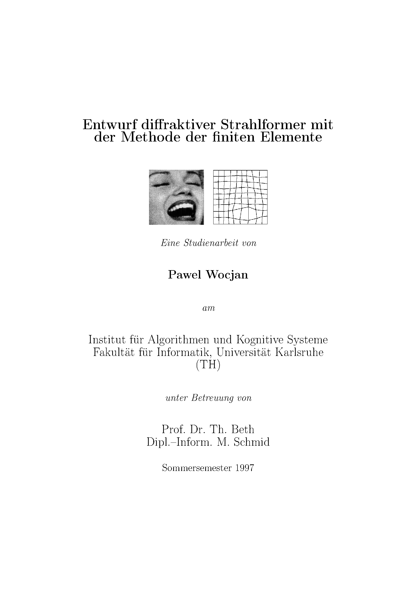

# Diffractive Beam Shaper Design via Finite Element Method

<p align="center">
  
</p>

<p align="center">
  <em>The title image from the 1997 Studienarbeit: Marilyn Monroe's face and the corresponding
  energy-equalized mesh. Notice how the mesh cells become larger over the dark mouth region
  (less energy) and smaller over the bright forehead and cheeks (more energy).</em>
</p>

## About This Project

This is a **Python re-implementation** of the methods described in:

> **Pawel Wocjan**, *"Entwurf diffraktiver Strahlformer mit der Methode der finiten Elemente"*
> (Design of Diffractive Beam Shapers Using the Finite Element Method),
> Studienarbeit, Institut für Algorithmen und Kognitive Systeme (IAKS),
> Fakultät für Informatik, Universität Karlsruhe (TH), Sommersemester 1997.
> Supervised by Prof. Dr. Th. Beth and Dipl.-Inform. M. Schmid.

The original implementation was written in **C++ in 1997** and was integrated into
**DigiOpt**, a diffractive optics design system developed at the IAKS under
Prof. Thomas Beth. Neither the original code nor DigiOpt exist anymore.
This Python version recreates the complete pipeline from scratch, almost 30 years later.

## The Problem: Diffractive Beam Shaping

In diffractive optics, the goal is to design a thin optical element — a
**diffractive phase element (DPE)** — that reshapes a laser beam into a desired
intensity pattern. For example, transforming a Gaussian laser beam into a
uniform square "flat-top" beam for laser material processing, or into a
company logo for marking applications.

The DPE is described by its **transmission function**:

$$T_{\text{DPE}}(x,y) = \exp\left(i\,\phi(x,y)\right)$$

where $\phi(x,y)$ is the **phase function** we need to compute. The DPE only
modifies the phase of the light (not its amplitude), so no energy is absorbed
— this is crucial for high-power applications.

In the optical setup, the input and output planes sit at the focal distance $f$
from a Fourier-transforming lens. **Wave propagation** between these planes is
described by the 2D Fourier transform (Fraunhofer approximation):

$$f_2 = \mathcal{F}\left\{ T_{\text{DPE}} \cdot f_1 \right\}$$

where $f_1$ is the input wavefront and $f_2$ is the output. Since only the
**intensity** $|f_2|^2$ matters (not its phase), there is a large design freedom
that the algorithms below exploit.

## The Method: Finite Element Meshes + Stationary Phase

### Core Idea

The key insight of the Studienarbeit is to use **finite element meshes** to
discretize the energy redistribution problem:

1. Lay **topologically equivalent meshes** over the input plane $E$ and the output
   plane $A$.
2. **Optimize the mesh node positions** so that corresponding cells in both meshes
   contain equal energy.
3. The node correspondences $\text{in}(i,j) \leftrightarrow \text{out}(i,j)$
   define a **discrete geometric transformation** $T$.
4. Recover the **phase function** $\phi(x,y)$ from $T$ using the **stationary
   phase approximation**.

This produces an excellent starting point for the **Iterative Fourier Transform
Algorithm (IFTA)**, which then refines it further.

### Step-by-Step Pipeline

#### Step 1 — Mesh Generation

Two mesh topologies are supported:

- **Rectangular topology** (Section 4.1): Nodes indexed by $(i,j)$ with
  $i,j \in \{0,\ldots,s{-}1\}$. Cells are quadrilaterals. Interior nodes have 4
  direct neighbors and 8 surrounding nodes. Best for square or rectangular targets.

- **Triangular topology** (Section 4.2): Nodes indexed by $(i,j)$ with
  $j = 0,\ldots,s{-}1$ and $i = 0,\ldots,j$. Cells are triangles. Interior nodes
  have 6 neighbors. Better for triangular or circular targets.

For the rectangular case, interior node positions are initialized using
**4-point interpolation** (Atkin, 1994): each interior node is computed as a
weighted average of its 4 associated boundary nodes, with weights depending on
the Euclidean distances in index space:

$$P_0 = \sum_{l=1}^{4} g_l \, P_l, \qquad g_1 = \frac{d_2 d_3 d_4}{(d_1{+}d_2)(d_1 d_2 {+} d_3 d_4)}, \quad \ldots$$

#### Step 2 — Mesh Optimization (Equal-Area / Equal-Energy)

**For constant-intensity signals** (e.g., a uniform circle to a uniform square),
the energy in each mesh cell is proportional to its area, so we optimize for
**equal area**.

For an interior node $P_0$ surrounded by 8 neighbors $P_1, \ldots, P_8$
(numbered counterclockwise starting from the top), the **ideal position**
$C(x_c, y_c)$ that equalizes the 4 surrounding cell areas is:

$$x_c = \frac{bf - de}{bc - ad}, \qquad y_c = \frac{af - ce}{bc - ad}$$

where $a = y_2 - y_8 - y_6 + y_4$, $b = x_2 - x_8 - x_6 + x_4$, etc.
(See Section 4.1 for the full formulas.) The node is then moved toward this
ideal position with step size $\alpha$:

$$P_0' = P_0 + \alpha \, (C - P_0)$$

iterated until convergence.

**For general intensity distributions** (Section 4.3), the area conditions are
**weighted by the energy** content of each cell. This is the key generalization
that allows handling arbitrary input/output beams. The energy in each
quadrilateral cell is computed by scanning pixels inside the polygon using a
**ray-casting point-in-polygon test**.

#### Step 3 — Phase Recovery (Polynomial Least Squares)

Once we have optimized meshes with node correspondences
$\text{in}(i,j) = (x_{ij}, y_{ij})$ and
$\text{out}(i,j) = (\phi_x^{ij}, \phi_y^{ij})$, we recover the phase.

By the **stationary phase condition**, the gradient of $\phi$ must satisfy:

$$\nabla \phi(x_{ij}, y_{ij}) = c \cdot \begin{pmatrix} \phi_x^{ij} \\\ \phi_y^{ij} \end{pmatrix}$$

We approximate $\phi$ as a **bivariate polynomial of degree $D{-}1$**:

$$\phi(x,y) = \sum_{k+l \le D-1} a_{kl} \, x^k y^l$$

The gradient conditions give a **linear system** for the $D(D{+}1)/2$ unknown
coefficients $a_{kl}$, which is solved via **least squares**.

#### Step 4 — IFTA Refinement

The phase from Step 3 serves as a **starting point** for the
**Iterative Fourier Transform Algorithm** (Gerchberg-Saxton / Fienup). IFTA
alternates between input and output planes:

- **Input plane**: replace amplitude with the known input signal $|f_1|$, keep phase.
- **Output plane**: replace amplitude with the desired $|f_2|$ (using phase freedom), keep phase.

The Studienarbeit runs **10 iterations for efficiency** followed by **20 for SNR**.

### The SepOp Baseline

The Studienarbeit also describes the **Separabilisierungsoperator (SepOp)** as a
competing method for generating IFTA starting points. SepOp maps any 2D signal
to a nearby separable signal:

$$\text{SepOp}: f(x,y) \;\mapsto\; \underbrace{\left(\int f(\xi, y)\, d\xi\right)}_{p(y)} \cdot \underbrace{\left(\int f(x, \xi)\, d\xi\right)}_{q(x)}$$

In the discrete case: $p(y) = \sum_x f(x,y)$ and $q(x) = \sum_y f(x,y)$, giving
the separable approximation $s(x,y) = q(x) \cdot p(y)$.

For separable signals, the 2D beam-shaping problem decomposes into two
independent 1D problems, each of which has an **analytical solution** — the mesh
becomes trivially a tensor product of two 1D grids. This makes SepOp fast and
parameter-free, but it can be inaccurate for highly non-separable signals.

### Quality Metrics

- **Signal-to-Noise Ratio**: measures how well the output matches the target
  $$\text{SNR}_I(f_2, f) = \frac{\|f\|^2}{\left\| |f_2| - \alpha|f| \right\|^2}, \qquad \alpha = \frac{\langle |f|, |f_2| \rangle}{\|f\|^2}$$

- **Diffraction Efficiency**: fraction of input energy reaching the signal window
  $$\eta = \frac{\|f\|^2_{W_{\text{Signal}}}}{\|f_1\|^2_{W_{\text{DE}}}}$$

### Original Results (1997)

These are the results from the Studienarbeit, comparing different starting
points for IFTA (10 efficiency + 20 SNR iterations):

| Input → Output         | Method  | SNR (dB) |  η (%) |
|------------------------|---------|----------|--------|
| Circle → Marilyn       | SepOp   |    19.3  |  78.6  |
|                        | Kugel   |    16.9  |  75.1  |
|                        | Random  |    13.8  |  68.9  |
|                        | **FEM** |  **20.8**|**79.0**|
| Insep. → Marilyn       | SepOp   |    32.8  |  92.1  |
|                        | **FEM** |  **35.8**|  86.0  |
| Gauss → Marilyn        | **SepOp** | **31.4** | **92.5** |
|                        | FEM     |    29.9  |  83.0  |
| Square → Marilyn       | FEM     |    20.5  |  78.0  |
|                        | **SepOp** | **20.8** | **79.1** |

The FEM method excels especially for non-separable input signals.

## Installation

### Prerequisites

- Python 3.8 or later
- pip (comes with Python)

### Setting Up a Virtual Environment

On **Windows** (with Python installed and available in PATH):

```powershell
# Open a terminal (PowerShell or cmd) and navigate to the project directory
cd path\to\diffractive_fem

# Create a virtual environment
python -m venv .venv

# Activate it
.venv\Scripts\activate

# Install dependencies
pip install -r requirements.txt
```

On **macOS / Linux**:

```bash
cd diffractive_fem
python3 -m venv .venv
source .venv/bin/activate
pip install -r requirements.txt
```

To **deactivate** the virtual environment when done:

```bash
deactivate
```

### VS Code Integration

If you use Visual Studio Code:

1. Open the `diffractive_fem` folder in VS Code.
2. Press `Ctrl+Shift+P` → "Python: Select Interpreter" → choose the `.venv` interpreter.
3. Open any `.py` file and run it with `F5` or the play button.
4. The integrated terminal will automatically activate the virtual environment.

## Quick Start

```bash
# Activate the virtual environment first, then:

# Main example: Gaussian → Square flat-top beam shaping
python examples/circle_to_square.py

# General signals: Gaussian → Cross pattern
python examples/gaussian_to_cross.py
```

Each example will print a results table to the console and save a figure
(`.png`) showing the meshes, phase function, output intensities, and IFTA
convergence curves.

## Project Structure

```
diffractive_fem/
├── README.md                      ← You are here
├── LICENSE_CODE                   ← GNU GPL v3 (Python code)
├── LICENSE_STUDIENARBEIT          ← CC BY 4.0 (original document)
├── requirements.txt               ← Python dependencies
│
├── diffractive_fem/               ← Python package
│   ├── __init__.py                ← Package metadata and public API
│   ├── mesh.py                    ← Mesh generation & optimization (§4.1–4.3)
│   ├── phase.py                   ← Polynomial least-squares phase recovery (§4.4)
│   ├── propagation.py             ← Fourier wave propagation model (§1)
│   ├── metrics.py                 ← SNR and diffraction efficiency (§5)
│   ├── ifta.py                    ← Iterative Fourier Transform Algorithm
│   └── visualization.py           ← Plotting utilities for meshes and results
│
├── examples/                      ← Runnable demo scripts
│   ├── circle_to_square.py        ← Gaussian → Square beam shaping
│   └── gaussian_to_cross.py       ← General intensity: Gaussian → Cross
│
└── studienarbeit/                 ← Original 1997 LaTeX source (modernized)
    ├── ausarb.tex                 ← Main document (German)
    ├── vortrag.tex                ← Presentation slides
    ├── titel.tex                  ← Title page
    └── *.pdf                      ← Figures (converted from EPS)
```

## Uploading to GitHub

If you have a GitHub account and Git installed:

```bash
# 1. Navigate to the project directory
cd path\to\diffractive_fem

# 2. Initialize a git repository
git init

# 3. Add all files
git add .

# 4. Make the first commit
git commit -m "Initial commit: Python re-implementation of 1997 Studienarbeit on diffractive beam shaping via FEM"

# 5. Create a new repository on github.com:
#    Go to https://github.com/new
#    Name it e.g. "diffractive-fem-beam-shaper"
#    Do NOT initialize with README (we already have one)
#    Click "Create repository"

# 6. Connect your local repo to GitHub (replace YOUR_USERNAME):
git remote add origin https://github.com/YOUR_USERNAME/diffractive-fem-beam-shaper.git
git branch -M main
git push -u origin main
```

If you haven't used Git from the command line before, GitHub will ask you to
authenticate. The easiest way is to install
[GitHub CLI](https://cli.github.com/) and run `gh auth login`, or use the
[GitHub Desktop](https://desktop.github.com/) app to push instead of the
command line.

### Recommended `.gitignore`

Create a file called `.gitignore` in the project root with:

```
__pycache__/
*.pyc
.venv/
*.egg-info/
dist/
build/
*.png
!studienarbeit/*.png
```

## Known Limitations and Future Work

### Mesh Energy Equalization

The current energy-equalization loop converges but not as tightly as the
original C++ code likely achieved. Possible improvements:

- **Adaptive step size**: decrease alpha as the iteration progresses, or use
  line search to find the optimal step.
- **Vectorized energy computation**: the current pixel-scanning inside polygons
  is done with Python loops. Replacing this with vectorized NumPy operations
  (or using `matplotlib.path.Path.contains_points`) would give a 10–50x
  speedup.
- **Exact Mathematica/Magma formulas**: for the energy-weighted 8-point
  algorithm, the original code used symbolic solutions from Mathematica that
  were then simplified with Magma. The current implementation uses a
  linearized approximation.

### Additional Examples to Implement

- **Marilyn Monroe test image**: the classic test image from the original
  Studienarbeit. Use any standard 256x256 grayscale portrait as the target
  intensity pattern and a Gaussian or circular flat-top as the input.
- **SepOp baseline**: implement the separability operator for direct comparison
  with the results tables from the Studienarbeit.
- **Triangular mesh examples**: circle to equilateral triangle beam shaping,
  demonstrating the 6-point interpolation and 9-point optimization.
- **Parameter sensitivity study**: systematic sweep over mesh density s and
  polynomial degree D to find optimal combinations.

### Performance

For production use with large grids (N = 512 or 1024), the mesh
optimization should be rewritten with NumPy vectorization or Cython/Numba JIT
compilation. The IFTA itself is already efficient (just FFTs), but the mesh
optimization is O(s^2 * size^2) per iteration due to the pixel-scanning
energy computation.

## The Original Studienarbeit

The `studienarbeit/` directory contains the **original LaTeX source from 1997**,
ported to modern LaTeX (pdfLaTeX-compatible, using `babel`, `amsmath`,
`amssymb`, and `graphicx` instead of the 1997-era `german.sty`, `mathsym.sty`,
and `epsf.sty`). The document is written in **German**.

To compile:

```bash
cd studienarbeit
pdflatex ausarb.tex
pdflatex ausarb.tex   # run twice for cross-references
```

The porting required creating a replacement for `mathsym.sty`, a local package
from the IAKS at Karlsruhe that defined blackboard bold symbols like `\R` and
`\C`. This package does not exist in any public TeX distribution.

## References

- H. Aagedal, *Optische Implementierung linearer Transformationen mittels
  diffraktiver Elemente*, Diplomarbeit, IAKS, Universität Karlsruhe, 1993.
- H. Aagedal, M. Schmid, S. Egner, J. Müller-Quade, Th. Beth, F. Wyrowski,
  *Analytical beam shaping with application to laser diode arrays*, JOSA A,
  Vol. 14, No. 7, 1997.
- J.E. Atkin, *Finite Elements for Analysis and Design*, Academic, London, 1994.
- T. Dresel, M. Beyerlein, J. Schwider, *Design and fabrication of
  computer-generated beam-shaping holograms*, Applied Optics 35, 4615–4621, 1996.
- T. Dresel, M. Beyerlein, J. Schwider, *Design of computer-generated
  beam-shaping holograms by iterative finite-element mesh adaptation*,
  Applied Optics 35, 6865–6874, 1996.
- R.W. Gerchberg, W.O. Saxton, *A practical algorithm for the determination
  of phase from image and diffraction plane pictures*, Optik 35, 237–264, 1972.
- Schmidt, Deussen, Kreeb, *Einführung in graphisch-geometrische Algorithmen*,
  Teubner, 1996.
- F. Wyrowski, O. Bryngdahl, *Iterative Fourier-transform algorithm applied
  to computer holography*, JOSA A, Vol. 5, No. 7, 1988.

## License

This project uses a **dual license**:

- **Python code** (`diffractive_fem/`, `examples/`):
  [GNU General Public License v3.0](LICENSE_CODE) — free to use, modify, and
  redistribute, provided derivative works are also open source under GPL v3.

- **Studienarbeit document** (`studienarbeit/`):
  [Creative Commons Attribution 4.0 International (CC BY 4.0)](LICENSE_STUDIENARBEIT) —
  you may share and adapt the document for any purpose, provided you give
  appropriate credit.

## Author

**Pawel Wocjan**

- Original C++ implementation (1997) at IAKS, Universität Karlsruhe (TH)
- Python re-implementation (2026)
